<div align="center">
  
<p align="center">
  
</p>
</div>

<p align="center">
  
  
  
  
  
  
</p>

<p align="center">
  
</p>

<p align="center">
  
  
  
  
  
  
  
  

</p>


# AICTE Unified Search System — 6 Fragmented Mock Data Sources → One Clean Store

A hackathon prototype that simulates how a body like AICTE ends up with
**disconnected databases** across colleges, courses, faculty, scholarships,
approvals and internships — each built by a different vendor/team, on a
different technology, with **no shared master ID** and **deliberately
inconsistent naming** — then cleans, links, deduplicates and unifies it all
into a single searchable canonical store.

**Status: Phases 1–4 complete & verified end-to-end** — data layer, harmonization
pipeline, canonical store + pgvector, Groq LLM retrieval, and a full search UI.

---

## Quick start

```bash
# 0) Prereqs: Docker Desktop running, Python 3.11 venv at internalenv/
bash manage.sh deps          # install python deps into internalenv/

# 1) Start the databases (MySQL :3307, Postgres :5433, Mongo :27017, Adminer :8080)
bash manage.sh up

# 2) Phase 1 — seed the 6 fragmented sources (idempotent, deterministic)
bash manage.sh seed

# 3) Phases 2+3 — clean, dedupe, load aicte_canonical + pgvector embeddings
internalenv/Scripts/python.exe pipeline/MAIN.py

# 4) Phase 4 — launch the search API + UI, then open http://localhost:8000
internalenv/Scripts/python.exe -m uvicorn api.app:app --port 8000
```

Optional: set `GROQ_API_KEY=gsk_...` in `.env` to enable the real LLM
(Groq text-to-SQL + grounded answer synthesis); without it the API runs in
mock-fallback mode and everything else still works.


---


## Progress — work done vs. work left

### ✅ Done (Phases 1–3, ~85%)

| # | Item | Status | Proof / detail |
|---|------|--------|----------------|
| 1 | Phase 1 — seed the 6 fragmented sources | ✅ 100% | **500 canonical institutes**; MySQL 518 · courses 1,403 · faculty 864 · Mongo 151 · CSVs 273 · internships 650; ground truth in `conflicts_seeded.json` |
| 2 | Phase 2 — integrated 13-stage pipeline | ✅ 100% | `pipeline/MAIN.py`; **3,859 messy records → 649 entities**; noise-reversal + RapidFuzz dedup; lineage on every row |
| 3 | Phase 3 — canonical store + pgvector | ✅ 100% | `aicte_canonical` (institution 498 · course 1,403 · faculty 864 · scholarship 151 · approval 273 · internship 650); **3,839 embeddings** (384-dim, HNSW) |
| 4 | Hybrid retrieval engine (CLI) | ✅ 100% | structured SQL + pgvector similarity + Groq answer synthesis; verified with real questions |
| 5 | Tests | ✅ 100% | `pytest pipeline/12_TESTS/TEST_PIPELINE.py` → 6/6 passing |
| 6 | Tooling & docs | ✅ 100% | Docker stack (MySQL/Postgres+pgvector/Mongo/Adminer), `manage.sh`, venv, README |

### ✅ Done (Phase 4)

| # | Item | Status | Proof / detail |
|---|------|--------|----------------|
| 1 | **FastAPI search API** | ✅ 100% | `api/app.py` — `GET /search` (rules → Groq text-to-SQL + pgvector, filters) and `GET /answer` (grounded, cited) |
| 2 | **Real LLM synthesis** | ✅ 100% | Groq (`openai/gpt-oss-120b`) via `GROQ_API_KEY`; mock fallback when unset |
| 3 | **Entity + conflict endpoints** | ✅ 100% | `GET /entity/{canonical_id}` (record + lineage), `GET /conflicts` (ground-truth validation) |
| 4 | Search UI (dark/gov themes, grouped results, lineage modal) | ✅ 100% | built into `api/app.py` at http://localhost:8000/ |

**In short: the data, cleaning and storage layers are done and verified;
the working retriever is exposed as an HTTP API (`api/app.py`) with a Groq
LLM for text-to-SQL and grounded answer synthesis.**


---


## Architecture

```mermaid



flowchart LR

    %% =========================
    %% PHASE 1 — DATA SOURCES
    %% =========================
    subgraph P1["PHASE 1 — Fragmented Data Sources"]
        A1["MySQL<br/>Institutes"]
        A2["PostgreSQL<br/>Courses"]
        A3["PostgreSQL<br/>Faculty"]
        A4["MongoDB<br/>Scholarships"]
        A5["Legacy CSV<br/>Student Data"]
        A6["CSV<br/>Internships"]
    end

    %% =========================
    %% PHASE 2 — PIPELINE
    %% =========================
    subgraph P2["PHASE 2 — Data Harmonization Pipeline"]
        B1["01 · INGEST<br/>Load all sources"]
        B2["02 · DISCOVER<br/>Detect structure & fields"]
        B3["03 · MAP<br/>Apply mapping rules"]
        B4["04 · STANDARDIZE<br/>Normalize values"]
        B5["05 · NORMALIZE<br/>Clean names & formats"]
        B6["06 · ENTITY RESOLUTION<br/>Match duplicate entities"]
    end

    %% =========================
    %% PHASE 3 — CANONICAL STORE
    %% =========================
    subgraph P3["PHASE 3 — Canonical Knowledge Store"]
        C1["07 · CANONICAL STORE<br/>Unified PostgreSQL"]
        C2["08 · PGVECTOR<br/>Generate embeddings"]
        C3["09 · CONTEXT + EMBED<br/>Semantic representation"]
    end

    %% =========================
    %% PHASE 4 — SEARCH
    %% =========================
    subgraph P4["PHASE 4 — Unified Search"]
        D1["User Query"]
        D2["FastAPI Search API"]
        D3["Groq LLM<br/>Text → SQL / Reasoning"]
        D4["Hybrid Retrieval<br/>SQL + Vector Search"]
        D5["Search UI"]
        D6["Grounded Answer"]
    end

    %% SOURCE → INGEST
    A1 --> B1
    A2 --> B1
    A3 --> B1
    A4 --> B1
    A5 --> B1
    A6 --> B1

    %% PIPELINE
    B1 --> B2
    B2 --> B3
    B3 --> B4
    B4 --> B5
    B5 --> B6

    %% CANONICAL STORE
    B6 --> C1
    C1 --> C2
    C2 --> C3

    %% SEARCH
    D1 --> D2
    D2 --> D3
    D3 --> D4
    C1 --> D4
    C3 --> D4
    D4 --> D5
    D5 --> D6

    %% STYLING
    classDef source fill:#1e293b,stroke:#64748b,color:#fff
    classDef pipeline fill:#312e81,stroke:#818cf8,color:#fff
    classDef store fill:#064e3b,stroke:#34d399,color:#fff
    classDef search fill:#4c1d95,stroke:#a78bfa,color:#fff
    classDef result fill:#78350f,stroke:#f59e0b,color:#fff

    class A1,A2,A3,A4,A5,A6 source
    class B1,B2,B3,B4,B5,B6 pipeline
    class C1,C2,C3 store
    class D1,D2,D3,D4,D5 search
    class D6 result

```




### Demo queries to try in the UI

| Query | What it exercises |
|-------|-------------------|
| `How many approved engineering colleges in Uttar Pradesh?` | rule path (exact SQL) |
| `courses with intake above 120 in Telangana` | Groq text-to-SQL (JOIN, filters) |
| `which colleges in Telangana offer M.Tech CS?` | LLM SQL + pgvector + grounded answer |
| `paid data science internship` | vector semantic match + facts (stipend, org) |
| `scholarship for meritorious students in Tamil Nadu` | vector similarity + citation |
| `AI/ML courses` | emerging-tech catalog + semantic match |
| `list closed engineering colleges` | current_status / approval filters |

## Phase 4 — Unified Search API (`api/app.py`, FastAPI + Groq)

Phase 4 wraps the working retriever (`11_RETRIEVAL/HYBRID_RETRIEVER.py`) in a
**FastAPI service** — the LLM part runs on **Groq** (`openai/gpt-oss-120b`
by default, `GROQ_API_KEY` in `.env`; falls back across other Groq models
automatically if the configured one is unavailable):

- **Hybrid, rules-first**: deterministic SQL rules answer the questions they
  know (counts / listings); when no rule matches, the Groq LLM **writes a safe
  SELECT** (`11_RETRIEVAL/TEXT_TO_SQL.py` — SELECT-only, table whitelist,
  statement timeout, LIMIT cap) which we execute against `aicte_canonical`,
  and the question is also embedded and matched against **pgvector**
  (`context_document`, HNSW).
- `GET /search?q=...&entity_type=...&state=...` — raw hybrid results:
  rule/LLM SQL rows + ranked pgvector hits (with similarity + citations)
- `GET /answer?q=...` — Groq-synthesized answer grounded **only** in retrieved
  context, with `[Source: ...]` citations; falls back to a mock synthesizer
  when no `GROQ_API_KEY` is set
- `GET /entity/{canonical_id}` — full record + lineage for any entity
- `GET /conflicts` — ground-truth validation vs `conflicts_seeded.json`
- `GET /health` — DB / pgvector / Groq status

Run it:

```bash
internalenv/Scripts/python.exe -m uvicorn api.app:app --port 8000
# open http://localhost:8000/ for the search UI, /docs for the API explorer

```

(Note: the Phase 1–3 status **dashboard** is a separate app that also uses
port 8000 — run it on another port, e.g. `--port 8001`, while the API is up.)

---

## Interactive workflow

```bash
# 1) Start the databases (MySQL :3307, Postgres :5433, Mongo :27017, Adminer :8080)
bash manage.sh up

# 2) Phase 1 — seed the 6 fragmented sources (idempotent, deterministic)
bash manage.sh seed

# 3) Phase 2 + 3 — clean everything, load aicte_canonical + pgvector embeddings
internalenv/Scripts/python.exe pipeline/MAIN.py

# 4) Verify — row counts across all sources + canonical store
bash manage.sh counts
docker exec aicte-postgres psql -Upostgres -d aicte_canonical \
  -c "SELECT entity_type, COUNT(*) FROM context_document GROUP BY 1 ORDER BY 1;"

# 5) Run the test suite (sample-data smoke tests)
internalenv/Scripts/python.exe -m pytest pipeline/12_TESTS/TEST_PIPELINE.py -v

# 6) Ask questions (Phase 4-style retrieval, mock LLM synthesis)
internalenv/Scripts/python.exe -c "
import sys; sys.path.insert(0, 'pipeline/11_RETRIEVAL')
from HYBRID_RETRIEVER import answer_question
print(answer_question('paid data science internship'))"

# 7) Dashboard — live view of all phases (run on :8001 while the API is on :8000)
internalenv/Scripts/python.exe -m uvicorn dashboard.app:app --port 8001
# open http://localhost:8001
```

`bash manage.sh help` lists everything: `up`, `pull`, `seed`, `counts`,
`samples`, `mysql`, `courses`, `faculty`, `mongo`, `adminer`, `deps`,
`status`, `logs`, `stop`, `down`, `wipe`, `fresh`.

## Demo


## Manual verification checklist (how to check each phase yourself)

### Phase 1 — sources seeded?
```bash
bash manage.sh counts            # row counts for all 5 sources + planted issues
bash manage.sh samples           # peek at actual rows (see the mess: different spellings)
docker exec aicte-mysql mysql -uaicte_app -paicte_pass aicte_institutes \
  -e "SELECT COUNT(*) FROM institutes;"          # expect 518
```
Expected: MySQL 518 · courses 1,403 · faculty 864 · Mongo 151 · CSVs
98/80/95 (closed/nba/unapproved) · internships 650 · 28 conflicts / 54 dups /
32 orphans logged in `conflicts_seeded.json`.

### Phase 2 — pipeline cleaned + deduplicated it?
```bash
internalenv/Scripts/python.exe pipeline/MAIN.py   # watch the 13 stages print
internalenv/Scripts/python.exe -c "import json; r=json.load(open('pipeline/run_reports/last_run.json',encoding='utf-8')); print(r['status'], r['entity_resolution'])"
# expect status 'ok' and 3,859 records -> 649 master entities
```
All 10 tracked stages must report `ok`; a failed stage is recorded in
`run_reports/last_run.json` (the dashboard shows it in red).

### Phase 3 — canonical store + embeddings?
```bash
docker exec aicte-postgres psql -Upostgres -d aicte_canonical \
  -c "SELECT 'institution' t, COUNT(*) FROM institution UNION ALL SELECT 'course', COUNT(*) FROM course UNION ALL SELECT 'faculty', COUNT(*) FROM faculty UNION ALL SELECT 'scholarship', COUNT(*) FROM scholarship UNION ALL SELECT 'approval', COUNT(*) FROM approval;"
# expect 498 / 1403 / 864 / 151 / 273 (plus 650 internships)
docker exec aicte-postgres psql -Upostgres -d aicte_canonical \
  -c "SELECT COUNT(*), vector_dims(embedding) FROM context_document GROUP BY 2;"
# expect 3,839 rows, 384 dims
```

### End-to-end retrieval sanity check
```bash
internalenv/Scripts/python.exe -c "import sys; sys.path.insert(0,'pipeline/11_RETRIEVAL'); from HYBRID_RETRIEVER import answer_question; print(answer_question('How many approved engineering colleges are there in Uttar Pradesh?'))"
# expect a number back, e.g. "18 approved college(s) in Uttar Pradesh"
```

### Dashboard (everything at a glance)
```bash
internalenv/Scripts/python.exe -m uvicorn dashboard.app:app --port 8001
# open http://localhost:8001 — Phase 1 cards, Phase 2 stage flow, Phase 3 store
```

---

## Managing the databases

- **Adminer** — http://localhost:8080 (MySQL + PostgreSQL browser UI)
- **pgAdmin / DBeaver / TablePlus** — connect to `localhost:5433`,
  user `postgres`, password `postgres`; the canonical store is **`aicte_canonical`**,
  the raw fragments are `courses_db` / `faculty_db` (note: use port **5433**,
  not 5432 — that's a local Postgres install, not this project's)
- **MongoDB Compass** — `mongodb://localhost:27017/aicte_scholarships`

## Directory layout

```
Internal_Matte/
├── docker-compose.yml          # MySQL + PostgreSQL(pgvector) + MongoDB + Adminer
├── .env                        # all credentials (nothing hardcoded)
├── seed_all.py                 # PHASE 1: seeds all 6 fragmented sources
├── seed/                       # registry, name-noise generator, per-source seeders (incl. generate_internships.py)
├── institute_registry.json     # 500 canonical institutes (internal truth)
├── conflicts_seeded.json       # GROUND TRUTH: every planted issue
├── pipeline/                   # PHASE 2+3: the integrated 13-stage pipeline
│   ├── MAIN.py                 #   run everything: ingest → clean → Postgres → pgvector
│   ├── 01_INGESTION … 14_DOCUMENTATION/
│   └── 12_TESTS/TEST_PIPELINE.py
├── data/legacy/                # Phase-1 legacy CSVs
├── manage.sh / manage.bat      # one-command control script
├── requirements.txt            # python deps (pandas, psycopg, fastembed, pgvector, …)
└── internalenv/                # Python 3.11 venv
```

## Notes

- **Embeddings**: fastembed (ONNX, lightweight) with
  `all-MiniLM-L6-v2` → 384-dim vectors; the same model embeds queries at
  retrieval time, so similarity is meaningful.
- **Env files**: `Internal_Matte/.env` holds DB credentials + `GROQ_API_KEY`;
  `pipeline/.env` holds pipeline-specific overrides (`POSTGRES_DB=aicte_canonical`,
  `EMBEDDING_MODEL`, `GROQ_MODEL`).
- **Idempotent**: re-seeding, re-running `MAIN.py`, and re-running the tests
  are all safe; every load truncates and rebuilds.


